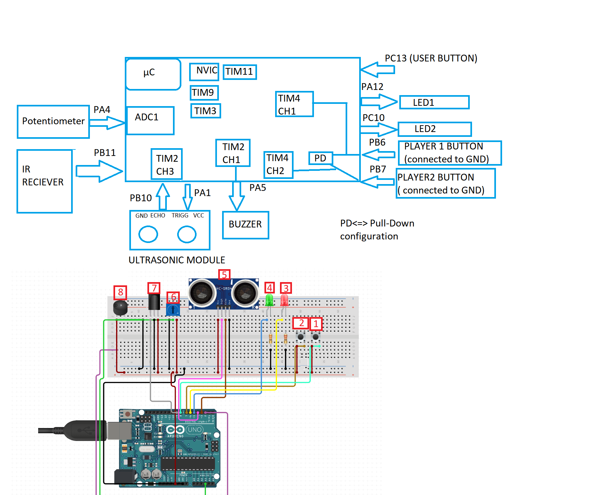

# STM32 Embedded Games & Utilities

> 🎮 **3 Mini-Games + Utilities**  
> 🚀 Built on **STM32** with Timers, ADC, UART, Ultrasonic Sensor, and IR Remote  

---

## 🎥 Full Demo Video
▶️ [Watch on YouTube](https://youtu.be/FvCqEcLT_tg)

---

## 🧩 Project Overview

This embedded systems project for the **STM32 microcontroller** implements a suite of **interactive mini-games and utilities**.  
It leverages multiple hardware peripherals: **timers, ADC, UART, DAC, GPIOs, an ultrasonic sensor, and an IR remote receiver using the NEC protocol**.  

Games are controlled through **buttons, UART serial interface, and IR remote control**, making it a **fun mix of hardware & software integration**.

---

## 🎮 Features

✅ **Reaction Time Game**  
- Two-player reflex challenge  
- LED lights up after a random delay → fastest button press wins  
- Timing captured with **TIM4 input capture**  
- Results displayed via **UART**

✅ **Countdown Challenge**  
- Players must wait until a countdown reaches zero before pressing  
- **Potentiometer (ADC)** sets difficulty (easy/normal/hard)  
- Early presses penalized, melodies played via **PWM (TIM2 & TIM3)**  
- Positive/negative reaction times printed via UART  

✅ **Greed Island (2D Console Game)**  
- Text-based 20×20 adventure game in UART terminal  
- Controlled with **IR remote (NEC protocol)**  
- Collect coins, avoid traps, manage HP, and win/lose  

✅ **Ultrasonic Distance Trigger**  
- Select games by moving your hand near the ultrasonic sensor (1–7 cm)  
- **TIM2 input capture** calculates echo duration → distance  

---

## 🏗️ Hardware Overview

  
*(Block diagram showing STM32, ultrasonic sensor, IR remote, buttons & UART)*  

| Peripheral | Purpose |
|------------|---------|
| **GPIO**   | LEDs, push buttons, ultrasonic trigger/echo, IR input |
| **TIM2**   | PWM melody generation, ultrasonic timing, delays |
| **TIM3**   | Tone timing (melody note durations) |
| **TIM4**   | Input capture for Reaction Time game |
| **TIM9**   | Delay timing (software delay) |
| **TIM11**  | NEC IR decoding |
| **ADC1**   | Potentiometer difficulty selection |
| **DAC**    | Initialized but not used in current version |
| **USART2** | UART communication with PC |
| **I2C1**   | Configured, ready for future peripherals |
| **EXTI**   | Button interrupts & IR receiver interrupts |

---

## 🌀 How It Works (Key Concepts)

### 📏 Ultrasonic Distance Trigger
- Ultrasonic module sends 10μs trigger pulse (PA1)
- Echo signal captured on PB10 via TIM2 input capture
- Pulse duration → distance = `time * 0.0343 / 2` cm

### 📡 IR NEC Protocol
- IR receiver → PB11 (EXTI)
- TIM11 measures pulse lengths:
  - >1700μs → logic `1`
  - 1000–1700μs → logic `0`
- After 32 bits decoded, mapped to movement commands in Game 3

### 🧭 UART Communication
- USART2 @ 115200 baud
- Menus, map updates, reaction times
- Send `X` to reset MCU (NVIC_SystemReset)

### ⏱ Countdown Difficulty via ADC
- Potentiometer → ADC1 12-bit conversion
- <1330 → Easy (2s delay)
- 1330–2600 → Normal (1s)
- >2600 → Hard (0.5s)

---

## 🌀 Flowcharts

**Example: TIM4 ISR for Reaction Time Game**  

*(More detailed flowcharts available in [Lab Report PDF](docs/Group%2016_LAB_REPORT.pdf))*  

---

## ▶️ Getting Started

1. Flash code to STM32 board via **STM32CubeIDE** or **ST-Link**
2. Open a UART terminal (Tera Term, PuTTY) at **115200 baud**
3. Wave your hand over ultrasonic sensor to trigger game menu
4. Play with:
   - On-board push buttons → Games 1 & 2
   - IR remote → Game 3 (Greed Island)

---

## 📌 Notes
- UART is the main feedback/debug interface
- Buttons & IR are **interrupt-driven** for accuracy
- Code is modular & future-proof (I2C, DAC, OLED display planned)

---

## 🏆 Academic Context & Achievement

This project was developed as part of the **Microprocessor-Based Digital Systems course** at *Universidad Carlos III de Madrid*.

- **Team Members:** Edouard David, Lucia Barranco Moreno, Maria Fernanda Montiel Zavala  
- **My Individual Contribution:** Implemented key peripherals (Timers, ADC, UART, IR NEC decoder), ultrasonic trigger logic, and the 2D Greed Island game.  
- **Individual Evaluation:** Achieved a **perfect grade of 10.4/10**, recognizing both technical implementation and documentation quality.

---

## 📜 Documentation
- [📄 Full Lab Report PDF](docs/Group%2016_LAB_REPORT.pdf)
- [📂 Source Code](src/)
- [🎥 Demo Video](https://youtu.be/FvCqEcLT_tg)

---

## 🔮 Future Improvements
- OLED display over I2C for graphical interface  
- DAC sound effects for richer melodies  
- Save/load game states via EEPROM  

---
