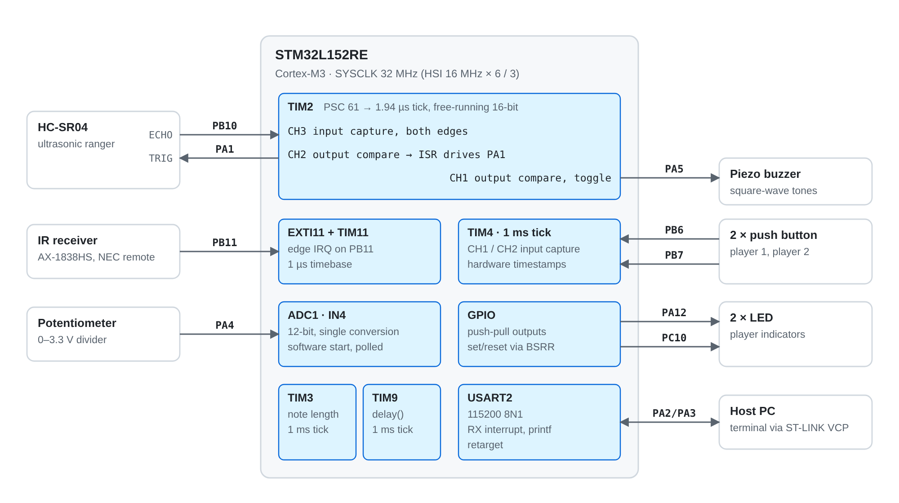
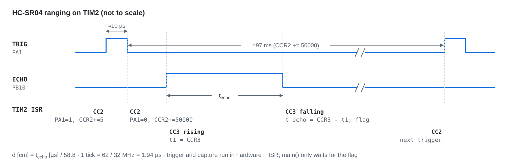
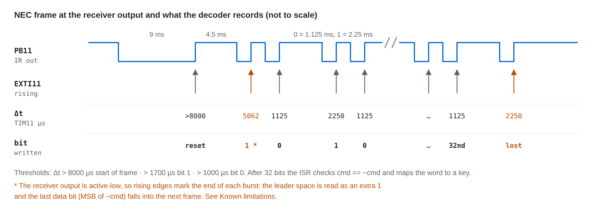
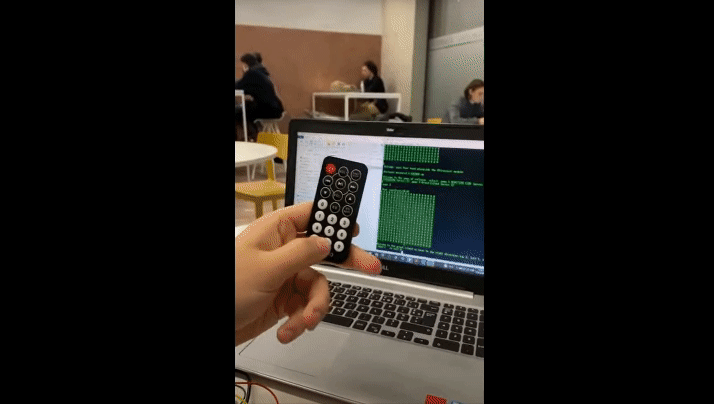

# Reaction-time console on STM32L152RE

Two-player reaction games on a NUCLEO-L152RE, written for the Microprocessor-Based Digital Systems course at Universidad Carlos III de Madrid (team of three). The games are the application; the point of the project is the firmware underneath. Timers, ADC, GPIO, EXTI and NVIC are configured by writing registers directly from the reference manual (RM0038). Pulse widths and button timestamps are captured by timer hardware instead of being measured by software loops.

- Ultrasonic ranging (HC-SR04): a 10 µs trigger is scheduled by output compare, and the echo width is measured by input capture on both edges.
- Infrared remote (NEC protocol): frames are decoded from edge-to-edge intervals, using an external interrupt and a 1 µs timer.
- Player buttons: presses are timestamped by input capture at 1 ms resolution, so interrupt latency never enters the measurement.
- Potentiometer: read by ADC1 (12-bit conversion, software start, polled).
- Buzzer tones: generated by output compare in toggle mode, with a second timer's interrupt sequencing the notes.

Demo video: <https://youtu.be/FvCqEcLT_tg>

<p align="center">
  <picture>
    <source media="(prefers-color-scheme: dark)" srcset="docs/img/system-dark.png">
    
  </picture>
</p>

## Hardware

| Part | Role |
|---|---|
| NUCLEO-L152RE (STM32L152RE, Cortex-M3) | MCU board; on-board ST-LINK for flashing and a virtual COM port |
| HC-SR04 | ultrasonic ranger, used as a proximity switch to open the menu |
| AX-1838HS + NEC remote | 38 kHz IR receiver/demodulator |
| PT-15 potentiometer | difficulty setting |
| 2 push buttons | player inputs |
| 2 LEDs | player indicators |
| Piezo buzzer | result tones |

Wiring: [`docs/img/breadboard_wiring.png`](docs/img/breadboard_wiring.png). The Fritzing drawing uses an Arduino Uno footprint in place of the Nucleo, which has the same header layout.

## Clock and timers

SYSCLK runs at 32 MHz: HSI 16 MHz, PLL ×6 then /3, voltage range 1, one flash wait state. AHB, APB1 and APB2 are undivided, so every timer counts at 32 MHz before its prescaler.

| Timer | PSC | Tick | Configuration | Used for |
|---|---|---|---|---|
| TIM2 | 61 | 1.94 µs | CH1 output compare (toggle) on PA5 · CH2 output compare (no pin) · CH3 input capture on PB10, both edges | tone, trigger scheduling, echo width |
| TIM3 | 31999 | 1 ms | CH2 output compare, interrupt | note duration |
| TIM4 | 31999 | 1 ms | CH1/CH2 input capture on PB6/PB7 | button timestamps |
| TIM9 | 31999 | 1 ms | CH1 output compare, flag polled | blocking `delay(ms)` |
| TIM11 | 31 | 1 µs | free-running counter | NEC symbol timing |

## Pin map

| Pin | Configuration | Connected to |
|---|---|---|
| PA1 | output, driven from the TIM2 CC2 interrupt | HC-SR04 TRIG |
| PB10 | AF1, TIM2_CH3 | HC-SR04 ECHO |
| PB11 | input, EXTI11 on rising edge | IR receiver output |
| PA4 | analog, ADC_IN4 | potentiometer wiper |
| PB6, PB7 | AF2, TIM4_CH1 / TIM4_CH2, internal pull-down | player buttons |
| PA12, PC10 | push-pull output, set/reset through BSRR | LEDs |
| PA5 | AF1, TIM2_CH1 | piezo buzzer |
| PA2, PA3 | USART2 TX/RX | ST-LINK virtual COM port |

## Peripherals in detail

### Ultrasonic ranging: TIM2 CH2 and CH3

TIM2 free-runs at 1.94 µs per tick. CH2 is an output compare with no pin attached. Its interrupt drives PA1 and re-arms itself by advancing CCR2: +5 ticks (≈10 µs) for the trigger pulse, then +50000 ticks (≈97 ms) before the next one. The trigger train therefore runs in the background without blocking the CPU.

CH3 captures both edges of ECHO on PB10. The ISR reads `GPIOB->IDR` to tell a rising edge from a falling one. It keeps the rising-edge timestamp, then computes the pulse width on the falling edge, with a correction for counter wrap. `main()` only waits for the resulting flag.

<p align="center">
  <picture>
    <source media="(prefers-color-scheme: dark)" srcset="docs/img/hcsr04_timing-dark.png">
    
  </picture>
</p>

Timer setup (excerpt from `src/main.c`, comments shortened):

```c
TIM2->PSC   = 61;           // 32 MHz / 62 -> 1.94 us per tick
TIM2->ARR   = 0xFFFF;       // free-running 16-bit
TIM2->DIER  = 0x000E;       // interrupts on CC1, CC2, CC3
TIM2->CCMR1 = 0x0030;       // CH1: toggle on match; CH2: frozen (timing only)
TIM2->CCMR2 |= 0x0001;      // CH3: input capture from TI3 (PB10)
TIM2->CCR2  = 5;            // first trigger edge after ~10 us
TIM2->CCER  = 0x0B00;       // CH3 capture enabled, both edges (CC3P = CC3NP = 1)
TIM2->EGR  |= 0x0001;       // update event: load PSC
TIM2->SR    = 0;
NVIC->ISER[0] |= (1 << 28); // TIM2 global interrupt
```

Distance is `d [cm] = t_echo [µs] / 58.8`: the round trip at about 340 m/s. The game menu opens when a hand is held 1 to 7 cm from the sensor.

### IR remote: EXTI11 and TIM11

The receiver strips the 38 kHz carrier. PB11 interrupts on each rising edge. The callback reads TIM11 (1 µs per tick) and clears it, so each interrupt sees the time since the previous edge. Intervals above 8 ms start a new frame, intervals above 1.7 ms add a 1 and intervals above 1.0 ms add a 0.

After 32 bits the callback checks the command byte against its inverted copy. It then maps the 32-bit word to one of ten keys (digits 0–9), which game 3 reads as directions (2, 4, 6, 8).

<p align="center">
  <picture>
    <source media="(prefers-color-scheme: dark)" srcset="docs/img/nec_timing-dark.png">
    
  </picture>
</p>

### Reaction timing: TIM4 input capture

Each button has its own TIM4 capture channel at 1 ms per tick. On an edge, the timer copies CNT into CCR1 or CCR2 in hardware; the ISR only reads the register. The reaction time is the captured value minus the counter value read when the LED was switched on. Its resolution is 1 ms, whatever the interrupt latency.

### Potentiometer: ADC1

Single conversion on channel 4, 12-bit, software start, polled (reformatted from `src/main.c`):

```c
while ((ADC1->SR & (1 << 6)) == 0);   // wait for ADONS: ADC ready
ADC1->CR2 |= (1 << 30);               // SWSTART
while ((ADC1->SR & (1 << 1)) == 0);   // wait for EOC
potent_value = ADC1->DR;              // 0..4095
```

Readings below 1330 (≈1.07 V) select a 2 s countdown step. Readings from 1330 to 2599 select 1 s, and readings of 2600 (≈2.10 V) and above select 0.5 s.

### Tones: TIM2 CH1 and TIM3 CH2

CH1 toggles PA5 on every compare match, and its interrupt restarts the counter. The pin therefore toggles every CCR1 ticks, giving `f = 516 kHz / (2 × CCR1)`: 64.5, 129 and 258 Hz for CCR1 = 4000, 2000 and 1000. TIM3 CH2 fires at the end of each note, and its interrupt loads the next CCR1 value. One three-note melody plays for an early press and another for a late one.

### Host link: USART2

The link runs at 115200 8N1 over the ST-LINK virtual COM port. `printf` is retargeted through `_write()` to `HAL_UART_Transmit`. Reception is interrupt-driven, one byte at a time: `1`, `2` and `3` select a game, and `X` calls `NVIC_SystemReset()`.

## Interrupts

| Handler | NVIC | Source | Work done |
|---|---|---|---|
| `TIM2_IRQHandler` | 28 | CC1, CC2, CC3 | restart counter (tone); drive TRIG and advance CCR2; latch echo edges and compute width |
| `TIM3_IRQHandler` | 29 | CC2 | load next note into `TIM2->CCR1`, flag end of melody |
| `TIM4_IRQHandler` | 30 | CC1, CC2 | copy each player's captured press time |
| `HAL_GPIO_EXTI_Callback` | 40 (EXTI15_10) | PB11 rising edge | NEC symbol decoding |
| `HAL_UART_RxCpltCallback` | 38 (USART2) | RXNE | store byte, re-arm reception, reset on `X` |

The timer interrupts are enabled by writing `NVIC->ISER` directly; EXTI and USART2 go through HAL. The ISR flowcharts from the course report are in [`docs/img/isr_tim2.png`](docs/img/isr_tim2.png), [`isr_tim3.png`](docs/img/isr_tim3.png) and [`isr_tim4.png`](docs/img/isr_tim4.png).

## Application

At power-up the firmware starts ranging. A hand held 1 to 7 cm from the sensor opens the menu on the terminal.

1. **Reaction time.** LED 1 lights after a random 1–5 s delay as the go signal. The winner's LED then lights, and their reaction time is printed in ms.
2. **Countdown.** The terminal counts down from 10 at the pace set by the potentiometer, and the last 1–3 numbers are hidden. Players press when they think it reaches zero. The signed error is printed, and the buzzer plays a different melody for early and late presses.
3. **Greed Island.** A 20×20 map is printed over UART, and the player moves with the IR remote, collecting coins while avoiding obstacles and traps. [`tools/greed_island_pc.c`](tools/greed_island_pc.c) is the desktop prototype of the same game.

<p align="center"></p>

## Known limitations

These are the issues I would fix in a second revision.

- **Shared flags are not `volatile`.** Flags written in ISRs and polled in `main()` (`new_measurement`, `End_Of_Melody`, `controller`, `recieved`, `time_player1/2`) are ordinary globals. The busy-wait loops work at -O0, but at higher optimisation levels the compiler is free to hoist the loads out of the loops.
- **Blocking control flow.** `delay()` spins on the TIM9 compare flag, and `main()` spins on ISR flags. A timer-driven state machine with `__WFI()` between events would free the CPU and cut current draw, which is what a low-power L1 part is designed for.
- **TIM2 has two users.** The tone channel's interrupt resets `TIM2->CNT`, but the rangefinder channels assume a free-running counter. After a melody, the leftover CCR1 can keep CNT from ever reaching CCR2, which stalls the trigger until the `X` reset. The tone belongs on its own timer in PWM mode (ARR = period, CCR = ARR/2), which needs no interrupt at all.
- **The IR decoder is off by one bit.**
    - **Cause:** the decoder interrupts on rising edges of an active-low receiver output. The leader space is therefore recorded as a 1, and the last bit of each frame spills into the next.
    - **Why the remote still works:** the key table was built from captured words, so all ten keys decode. The address and command fields are shifted by one bit, though: key 0 is address 0x00, command 0x16, stored as `0x807FB44B`. The inverse check only passes because every command on this remote is below 0x80.
    - **Fix:** interrupt on falling edges, and detect TIM11 wrap-around (65.5 ms) when testing for the start-of-frame gap.
- **Arithmetic.** The TIM2 tick is 1.9375 µs, but the distance formula assumes 2 µs, which adds 3.2 % to every range. The integer division limits distance to 1 cm steps, and the wrap correction adds `0xFFFF` instead of `0x10000`. Subtracting in `uint16_t` handles the wrap for free.
- **Smaller issues.**
    - The buttons are not debounced: bounce edges overwrite the captured time. Setting ICxF in CCMRx would filter them.
    - `End_Of_Melody` is never cleared, so later melodies are cut short.
    - Game 3 allocates its map with `malloc` on every start and never frees it.

## Build and flash

The repository contains the application sources only. The CubeMX-generated files are not included: startup code, HAL, `main.h`, `stm32l1xx_it.c` and `stm32l1xx_hal_msp.c`. The register-level code relies on the generated `HAL_*_MspInit` functions to enable the peripheral clocks. To rebuild:

1. Create an STM32CubeIDE project for NUCLEO-L152RE.
2. In the configurator, enable the peripherals so their clocks and interrupt vectors are generated:
    - ADC (IN4), DAC (OUT2) and I2C1;
    - TIM2, TIM3, TIM4, TIM9 and TIM11 (TIM11 prescaler 31);
    - USART2 in asynchronous mode at 115200, with its interrupt;
    - PB11 as EXTI11 on the rising edge, with the EXTI15_10 interrupt;
    - but leave the TIM2, TIM3 and TIM4 interrupts disabled: their handlers are defined in `main.c`, and generated ones would clash.
3. Replace the generated `main.c` with `src/main.c`, and add `src/UTILS.c` and `src/UTILS.h`.
4. Build, flash through the on-board ST-LINK, and open a terminal at 115200 8N1.

DAC and I2C1 are initialised but not used.

## Repository layout

```text
src/main.c                 application: register-level setup, ISRs, games
src/UTILS.c, UTILS.h       printf retarget (_write), integer-to-ASCII
tools/greed_island_pc.c    desktop prototype of game 3
docs/lab_report.pdf        course report: block diagram, wiring, ISR flowcharts
docs/code_listing.pdf      code as submitted
docs/img/                  diagrams, wiring, flowcharts, demo GIF
```

## Context

- **Course:** Microprocessor-Based Digital Systems, Universidad Carlos III de Madrid.
- **Team:** Edouard David, Lucia Barranco Moreno, Maria Fernanda Montiel Zavala.
- **My part:** timer configuration, ADC, UART, the NEC decoder, the ultrasonic trigger and echo logic, and game 3.
- **Grade:** 10.4 / 10.
